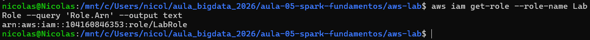
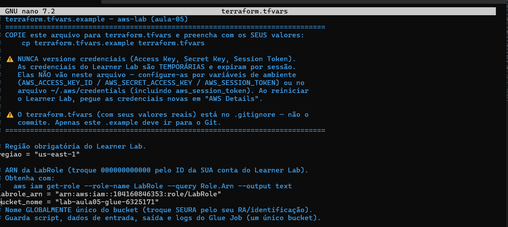
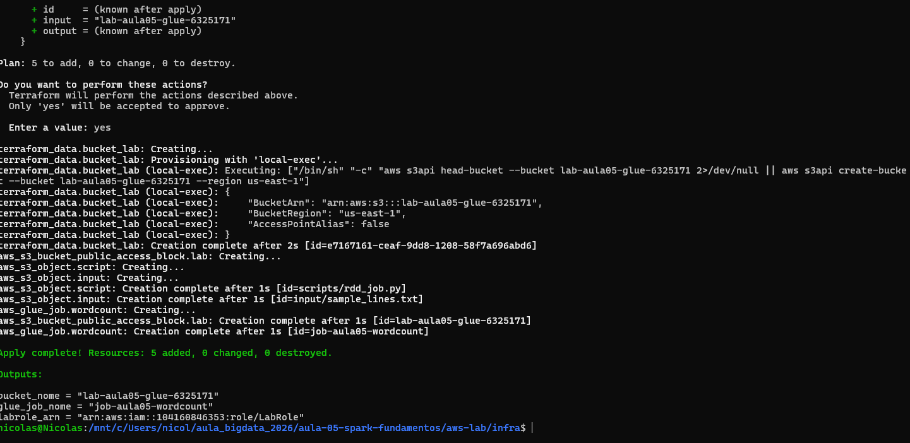
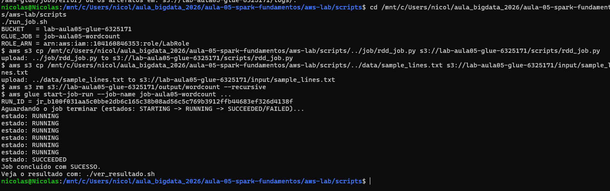
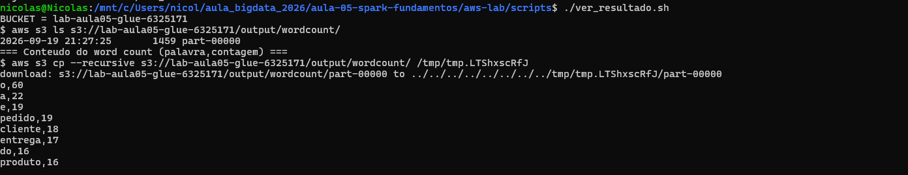
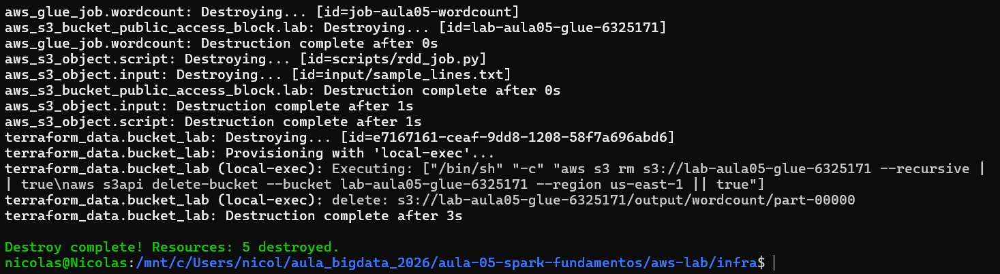

# Evidencias - Aula 05 (Spark RDDs na AWS Glue)

## Identificacao

- Nome: Nicolas de Jesus Silva
- RA: 6325171
- Branch: aula-05-aws-6325171
- Data: 2026-09-19

## 1. LabRole

O ARN da LabRole foi obtido com `aws iam get-role`.



## 2. Configuracao Terraform

O `terraform.tfvars` foi configurado com a regiao `us-east-1`, o ARN da LabRole e o bucket `lab-aula05-glue-6325171`.



## 3. Terraform apply

O apply foi concluido com 5 recursos criados, incluindo o bucket, os uploads e o Glue Job.



## 4. Job Glue

O job terminou com estado `SUCCEEDED` e RUN_ID `jr_b1000f3aa5c0bbe9652dbe6165c38b08ad56c5c793912ffb44683ef3264d138f`.



## 5. Resultado do word count

O resultado foi gravado no S3 em `output/wordcount/part-00000`.



Top 5:

```text
o,60
a,22
e,19
pedido,19
cliente,18
```

Interpretacao: as palavras mais frequentes refletem um texto de pedidos e operacoes de uma loja online. Os RDDs foram processados pelo driver e pelos executors do Glue, que dividiram as linhas em palavras e agregaram as ocorrencias com `reduceByKey`.

## 6. Logs do driver

Opcional: adicionar `06-driver-log.png` com os logs do CloudWatch.

## 7. Limpeza

Os recursos foram removidos com sucesso: `Destroy complete! Resources: 5 destroyed.`


